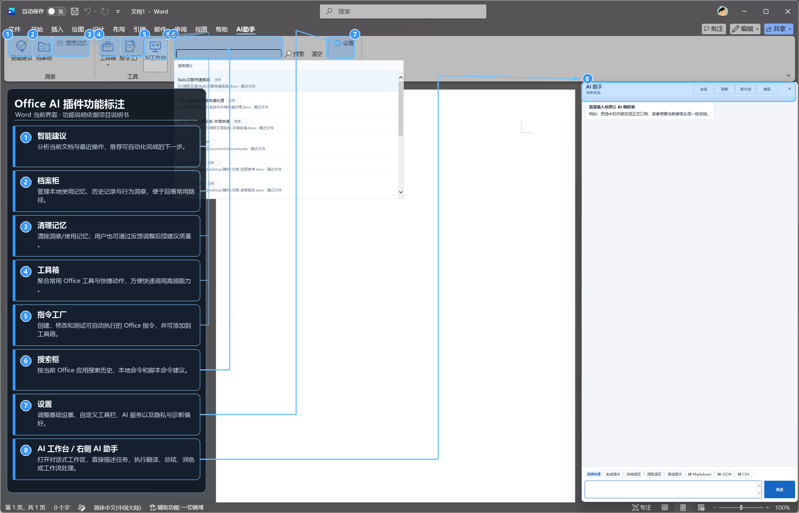
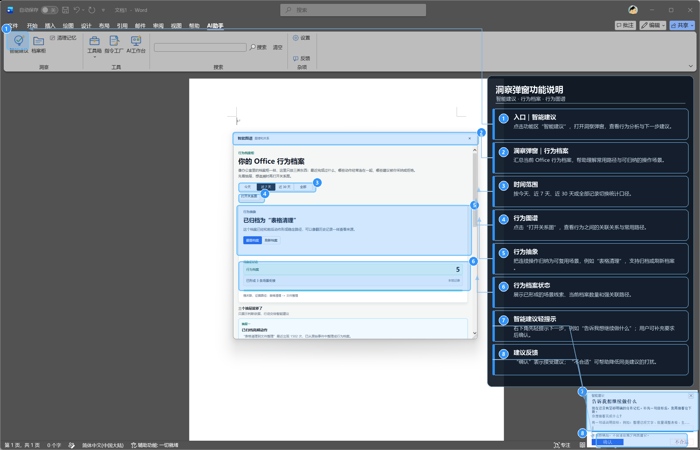
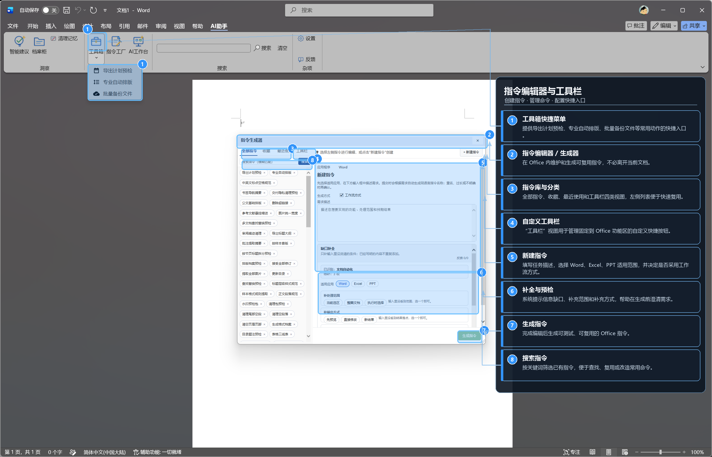
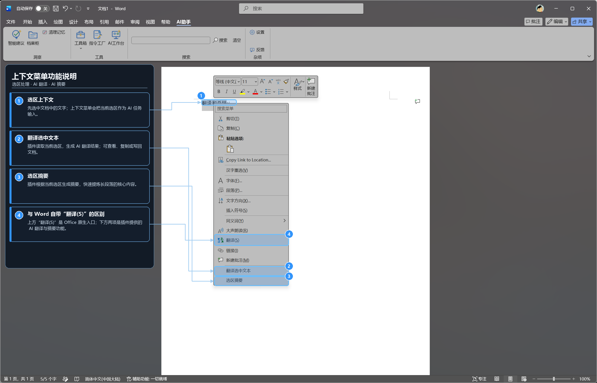
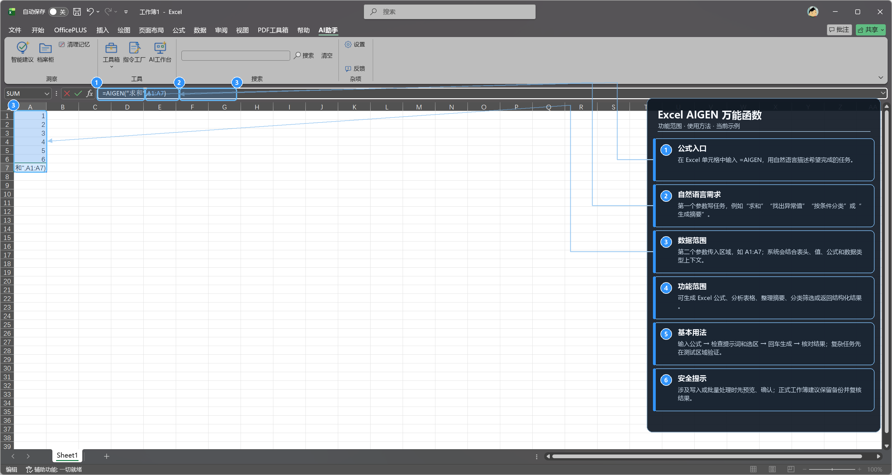
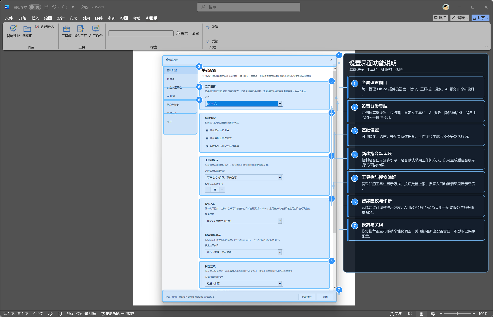

# OfficeAddin UI Guide / OfficeAddin 界面指引

This guide explains the main user-visible entry points in the Windows desktop Office add-in. The screenshots are real Word and Excel runtime views with numbered annotations. Feature names and availability can vary by release, Office application, user settings, and network state; use the labels visible in the installed build as the source of truth.

本指引说明 Windows 桌面版 Office 插件的主要界面入口。截图来自 Word、Excel 的真实运行界面，并用编号标出了功能位置。具体名称和可用范围可能随版本、Office 应用、用户设置和网络状态变化，请以已安装版本中实际显示的标签为准。

## 1. Ribbon entry and AI Workbench / 功能区入口与 AI 工作台

Open Word, Excel, or PowerPoint and select the `Office AI` / `AI助手` Ribbon tab. The tab groups Smart Suggestions, the behavior archive, Clear Memory, Toolbox, Command Factory, AI Workbench, search, settings, and feedback in one place. Search finds history, local commands, and script-command suggestions for the active Office application. AI Workbench provides a right-side conversation area where the user can describe a bounded task.

打开 Word、Excel 或 PowerPoint 后进入 `Office AI` / `AI助手` 功能区。该页签集中提供智能建议、档案柜、清理记忆、工具箱、指令工厂、AI 工作台、搜索、设置和反馈。搜索会结合当前 Office 应用查找历史记录、本地命令和脚本命令建议；AI 工作台在右侧提供对话式任务区，用户可以直接描述有边界的任务。

Figure 1. Ribbon entry, search, settings, and the right-side AI Workbench. / 图 1：功能区入口、搜索、设置与右侧 AI 工作台。

Recommended flow / 推荐流程：

1. Open the `Office AI` / `AI助手` tab. / 打开 `Office AI` / `AI助手` 页签。
2. Search for an existing command, or open AI Workbench and describe the task. / 搜索已有指令，或打开 AI 工作台描述任务。
3. Review the scope and preview before a document-writing operation. / 涉及文档写入时先查看范围和预览。

## 2. Smart Suggestions and behavior graph / 智能建议与行为图谱

Smart Suggestions are optional assistance. The insight window summarizes the current behavior archive, recent operation patterns, time-range filters, and related paths. The user can inspect the behavior graph, accept a suggestion, add requirements, postpone it, or mark it as unsuitable. A suggestion is not an unattended write operation; important document changes still require review and confirmation.

智能建议是可选帮助。洞察窗口会展示当前行为档案、近期操作模式、时间范围和关联路径。用户可以查看行为图谱、接受建议、补充要求、稍后处理或标记为不合适。智能建议不等于无人值守写入，重要文档修改仍需复核和确认。

Figure 2. Smart Suggestions, behavior archive, behavior graph, and feedback. / 图 2：智能建议、行为档案、行为图谱与建议反馈。

## 3. Command Factory and custom toolbar / 指令工厂与自定义工具栏

Command Factory turns a repeatable manual process into a named Office command. The left side contains the command library and categories; the right side contains the task description and generation fields. Select the applicable Office applications, describe one clear goal, complete missing information, and use test or preview before saving. Frequently used commands can be placed in the custom toolbar. Toolbox also exposes common actions such as export-plan preflight, formatting, and batch backup.

指令工厂用于把可重复的手工流程沉淀为命名的 Office 指令。左侧是指令库和分类，右侧是任务描述及生成字段。用户选择适用的 Office 应用，写清一个明确目标，根据提示补全信息，并在保存前进行测试或预览。高频指令可以固定到自定义工具栏；工具箱还提供导出计划预检、排版和批量备份等常用动作。

Figure 3. Command library, generator, Toolbox menu, and custom toolbar entry. / 图 3：指令库、指令生成器、工具箱菜单与自定义工具栏入口。

## 4. Context menu translation and summary / 上下文菜单翻译与摘要

Select text in Word and open the context menu. The screenshot distinguishes Word's native `Translate` item from the add-in entries `Translate selected text` and `Summarize selection`. The add-in uses the selected range as task context, creates an AI task, and returns a result for review, copy, or optional write-back.

在 Word 中选中文字后打开上下文菜单。截图区分了 Word 原生的 `翻译(S)`，以及插件提供的 `翻译选中文本` 和 `选区摘要`。插件以当前选区作为任务上下文，创建 AI 任务并返回结果，用户可以复核、复制，或按确认流程选择写回。

Figure 4. Native Word translation and Office AI translation/summary entries. / 图 4：Word 原生翻译与 Office AI 翻译/摘要入口。

## 5. Excel AIGEN function / Excel AIGEN 函数

In Excel, enter `=AIGEN(` in a target cell. The first argument is a natural-language task and the second argument is a data range, for example `=AIGEN("sum",A1:A7)`. AIGEN can generate formulas, filter or summarize tables, inspect anomalies or formula issues, classify data, and return structured output. It combines workbook, worksheet, header, cell-value, formula, and data-type context. Start with a small test range and verify the result before applying it to a formal workbook.

在 Excel 目标单元格中输入 `=AIGEN(`。第一个参数是自然语言任务，第二个参数是数据区域，例如 `=AIGEN("求和",A1:A7)`。AIGEN 可用于生成公式、筛选或汇总表格、检查异常值或公式问题、分类处理以及返回结构化结果。系统会结合工作簿、工作表、表头、单元格值、公式特征和数据类型上下文。建议先用小范围测试并核对结果，再应用到正式工作簿。

Figure 5. AIGEN formula entry, natural-language task, and data range. / 图 5：AIGEN 公式入口、自然语言任务与数据范围。

## 6. Settings and diagnostics / 设置与诊断

Open Settings to manage language, command defaults, custom toolbar display, search entry and result density, AI service routing, Smart Suggestions, privacy, diagnostics, message center, and About information. The settings window separates user preferences from task execution. Changing a preference does not itself modify the active document. Use `Restore recommended` when you need to undo personalized settings.

打开设置界面可以管理显示语言、指令默认行为、自定义工具栏显示方式、搜索入口和结果密度、AI 服务路由、智能建议、隐私、诊断、消息中心和关于信息。设置窗口把用户偏好与任务执行分开，修改偏好本身不会修改当前文档；需要撤销个性化设置时可以使用“恢复推荐”。

Figure 6. Global settings, basic options, toolbar/search preferences, and Smart Suggestions. / 图 6：全局设置、基础选项、工具栏/搜索偏好与智能建议。

## 7. Capability boundary and data handling / 能力边界与数据处理

OfficeAddin is a Windows desktop COM add-in for the installed desktop versions of Word, Excel, and PowerPoint. It works with the active Office context, selected text, cell ranges, slide objects, user commands, and configured local files. It is not a browser-only document editor and does not claim support for non-Windows Office, WPS, or mobile Office.

OfficeAddin 是面向 Windows 桌面版 Word、Excel、PowerPoint 的 COM 插件，处理当前 Office 上下文、选中文本、单元格区域、幻灯片对象、用户命令和用户指定的本地文件。它不是纯 Web 文档编辑器，也不声明支持非 Windows Office、WPS 或移动版 Office。

AI, feedback, telemetry, and diagnostics are user-triggered or controlled by the active settings. AI requests are limited to the selected content, prompt, and context needed for the active task; routine local operations are not described as uploading a complete document. Configuration, command metadata, task logs, insights, and feedback attachments are stored or processed according to the installed build and settings. Users should review and redact sensitive content before sending it to an AI service or attaching it to feedback.

AI、反馈、遥测和诊断功能由用户主动触发或受当前设置控制。AI 请求以当前任务所需的选区、提示词和必要上下文为限；普通本地操作不应被理解为自动上传完整文档。配置、命令元数据、任务日志、洞察记录和反馈附件的存储或处理方式以当前安装包和设置为准。向 AI 服务发送内容或提交反馈前，应先检查并脱敏敏感信息。

For document writes, script execution, file operations, or batch processing, review the plan or preview and confirm before commit. Keep an original or backup copy for important work. If the scope or result is unclear, cancel and verify rather than continuing.

涉及文档写入、脚本执行、文件操作或批量处理时，应先查看计划或预览并确认后再提交。重要工作请保留原件或备份；如果范围或结果不清楚，应取消并核对，不要继续扩大操作。

## 8. Installation and support / 安装与反馈

Download the installer and matching SHA256 from the same official Release, close Office before installation, then reopen Office and verify the Ribbon entry. For an issue report, include the Office application, Windows version, Office version and bitness, add-in version, entry point used, expected result, actual result, and reproduction steps. Do not post customer documents, credentials, tokens, private keys, or unredacted logs in public Issues.

从同一个官方 Release 下载安装包和对应 SHA256，安装前关闭 Office，安装后重新打开 Office 并检查功能区入口。反馈问题时请附上 Office 应用、Windows 版本、Office 版本及位数、插件版本、使用的入口、预期结果、实际结果和复现步骤。不要在公开 Issue 中发布客户文档、凭据、令牌、私钥或未经脱敏的日志。

See [Usage / 使用指南](usage.md), [Product / 产品介绍](product.md), [Privacy / 隐私](privacy.md), and [Compatibility / 兼容性](compatibility.md) for related details.
